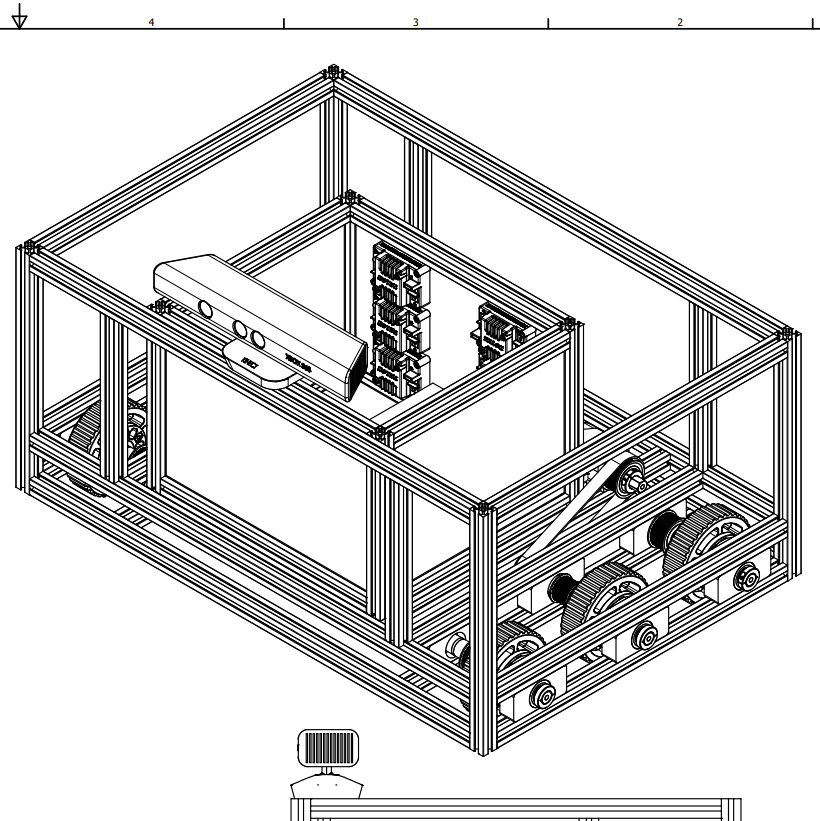
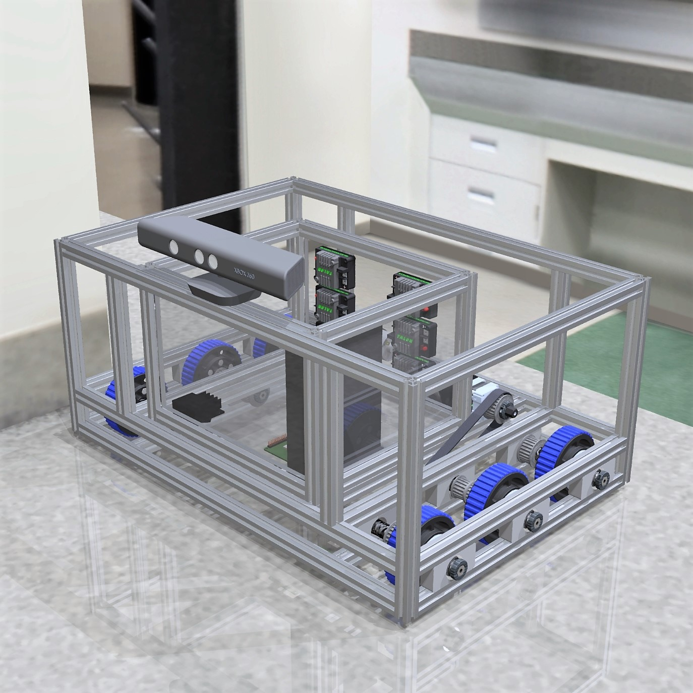

# Clark CAD
Clark is a 60-pound custom designed and fabricated robot running on ROS. It is autonomous and uses sensor fusion, computer vision, and a convolutional neural network to navigate its surroundings.

Clark uses a variety of sensors to determine its position, including an Xbox 360 Kinect, a three-camera vision system, a 9-axis Inertial Measurement Unit (IMU), rotary encoders, and various other feedback sources. Clark is driven by a 6 wheel "West Coast" drop-center drive, giving it superb traction on most surfaces and the ability to turn in place.

In this repository, you can find the full CAD, which has been open sourced.

## Digital Renderings of Clark

  

    <h4>Wireframe Rendering</h4>
    
  

  

    <h4>Color Rendering</h4>
    
  

